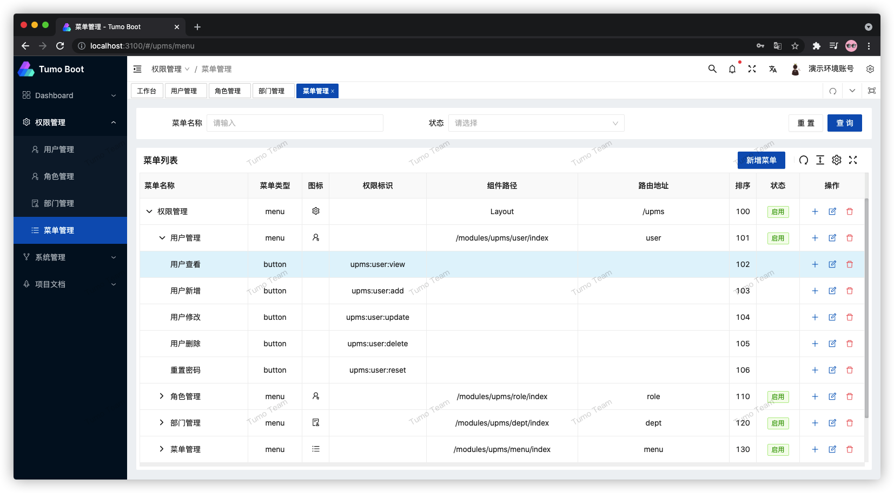

    

    <a href="https://github.com/Tumo-Team" target="_blank">
        <strong>Tumo Team —— Tumo-Boot</strong>
    </a>

## 项目介绍

**[Tumo-Boot](https://github.com/Tumo-Team/tumo-boot)** 是基于SpringBoot2.5.x、SpringSecurity的RBAC项目脚手架，前端基于Node、Vue3.x、Ant-Design-Vue2.x、Vite、TypeScript。

如果你已经熟悉了RBAC单体项目开发，你可以学习 **Tumo-Cloud：** [https://github.com/Tumo-Team/tumo-cloud](https://github.com/Tumo-Team/tumo-cloud)。

## 项目地址

- Tumo-Boot项目预览：[http://boot.tycoding.cn](http://boot.tycoding.cn)
- Tumo-Boot文档预览：[http://docs.boot.tycoding.cn](http://docs.boot.tycoding.cn)
- Tumo-Boot后端源码：[https://github.com/Tumo-Team/tumo-boot](https://github.com/Tumo-Team/tumo-boot)
- Tumo-Boot前端源码：[https://github.com/Tumo-Team/tumo-boot-ui](https://github.com/Tumo-Team/tumo-boot-ui)
- Tumo-Boot文档源码：[https://github.com/Tumo-Team/tumo-boot-docs](https://github.com/Tumo-Team/tumo-boot-docs)

## 技术栈

**环境**

| Name  | Version   |
| ----- |-----------|
| JDK   | 1.8       |
| MySql | 8.x       |
| OS    | MacOS13.x |
| IDEA  | 2022.x    |

**后端**

| Name            | Version | Document                                                     |
| --------------- |---------| ------------------------------------------------------------ |
| Spring Boot     | 2.x     | [https://github.com/spring-projects/spring-boot](https://github.com/spring-projects/spring-boot) |
| Mybatis-Plus    | 3.x     | [https://baomidou.com/guide/](https://baomidou.com/guide/)   |
| Hutool          | 5.x     | [https://hutool.cn/docs/#/](https://hutool.cn/docs/#/)       |

**前端**

| Name           | Version | Document                                                     |
| -------------- |-------| ------------------------------------------------------------ |
| Vben           | 2.x   | [https://github.com/anncwb/vue-vben-admin](https://github.com/anncwb/vue-vben-admin) |
| Vue.js         | 3.x   | [https://cn.vuejs.org/v2/guide/](https://cn.vuejs.org/v2/guide/) |
| Ant-Design-Vue | 2.x   | [https://www.antdv.com/docs/vue/introduce-cn/](https://www.antdv.com/docs/vue/introduce-cn/) |

## 运行项目

详细的文档请看：[http://docs.boot.tycoding.cn](http://docs.boot.tycoding.cn)

## 图片预览

## License

[MIT](https://github.com/Tumo-Team/tumo-boot/blob/master/LICENSE)

Copyright (c) 2021-present TyCoding

